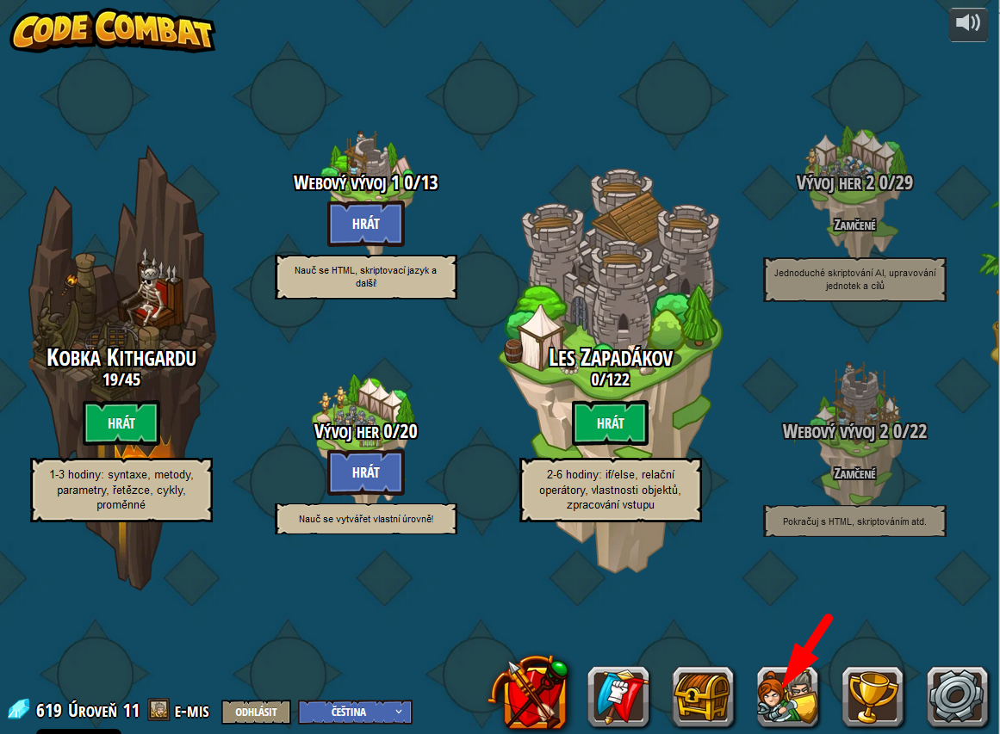
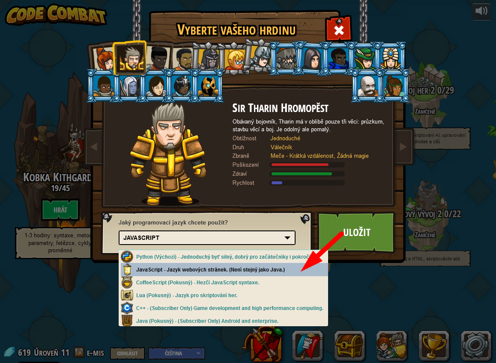
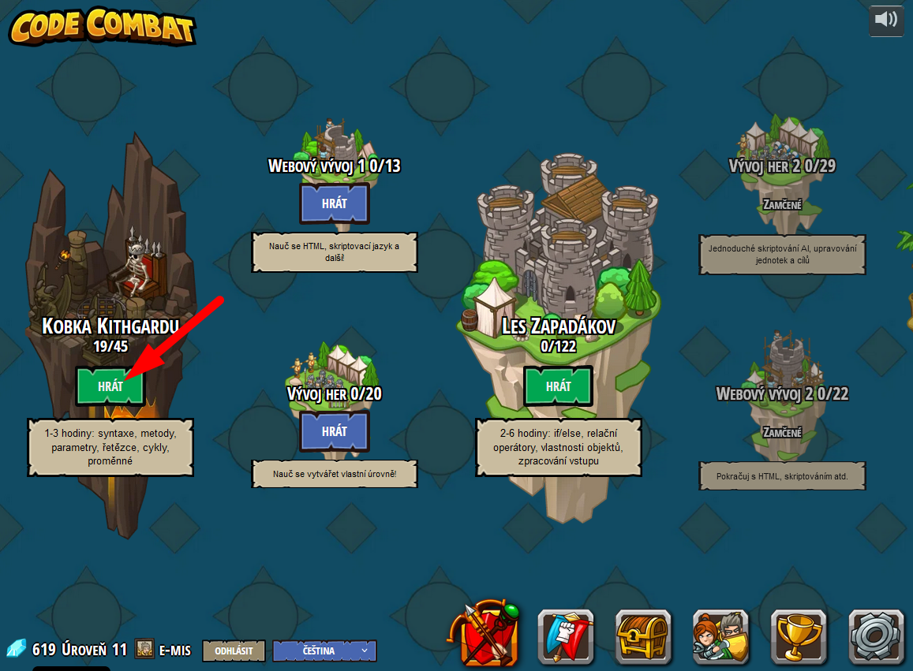
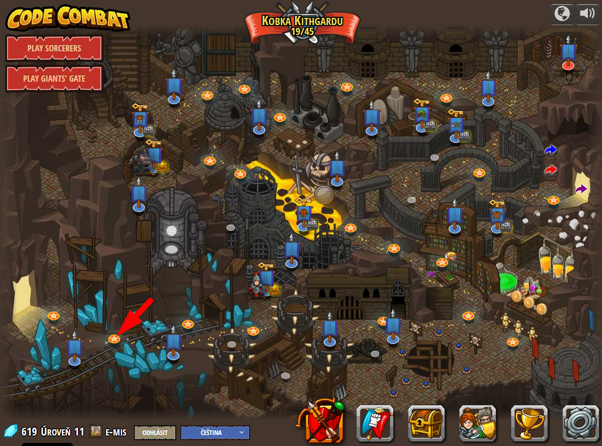

# Návod na hraní CodeCombat.com

[CodeCombat.com](https://www.codecombat.com) ti nabízí možnost naučit se základy zápisu kódu prostřednictvím hraní počítačové hry.

Ve hře budeš ovládat svého hrdinu, který bude procházet sklepeními a bojovat s&nbsp;nepřáteli. Ovládat ho ale nebudeš šipkami či myší, ale psaním příkazů programovacího jazyka.

> Cílem je naučit se základní syntaxi programovacích jazyků intuitivní formou.

# Přihlášení a nastavení prostředí

# Volba programovacího jazyka

Volbu programovacího jazyka provedeš společně s&nbsp;volbou svého hrdiny:

1. Klikni na ikonku Volby hrdiny.
2. V&nbsp;roletovém menu vyber jazyk _JavaScript_.
3. (Můžeš si také vybrat postavičku, se kterou budeš hrát. To nemá na hru žádný další vliv.)

# Hra

Nyní si již jen vybereš svět (na začátku máš k&nbsp;dispozici jen _Hrobky Kithgardu_, k&nbsp;dalším se propracuješ později) a&nbsp;zvolíš úroveň.

> Některé úrovně jsou placené. Ale těm se můžeš vyhnout. Neboj, je tam dost úrovní zdarma!

